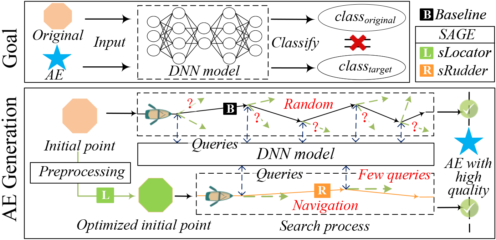

# 🧙‍ TIFS_SAGE


**SAGE: Steering the Adversarial Generation of Examples with Accelerations**

The main goal of <u>SAGE</u> is to reduce the number of queries when generating a high-quality adversarial example (AE). We design two components (<u>sLocator</u> and <u>sRudder</u>) that exploit bbox to capture salient pixels to advance the black-box attacks. Specifically, they are used to accelerate the two steps of a black-box attack respectively.

(i)  In the initialization step, sLocator can find a starting point that is close to the final AE; 
(ii) In the searching step, sRudder can steer the perturbation direction in each query based on the salient features. 

Note that we set the same success condition for SAGE and baseline methods, which means SAGE can achieve query-efficient attacks while guaranteeing to generate the high-quality AEs. 

## Attack Process

The "Attack Process" folder shows the videos of the attack process for four experiments. 

Among them, experiment 1 describes SAGE accelerating the HSJA attack (Macaron -> Black-footed ferret); 

Experiment 2 describes compare results between SAGE and hybrid attack framework (Number 0 -> Number 1); 

Experiment 3 describes SAGE accelerating the HSJA attack (Sea Snake -> Ceramics) to achieve the same L2 threshold; 

Experiment 4 describes SAGE accelerating the HSHA attack (ALPS > chairs) under the same number of queries.

## Code

The "Code" folder shows the SAGE's source code.

## How to install

SAGE requires Python 2.0+/3.0+ .

### Requirements

```bash
pip install -r code/requirements.txt
```

SAGE can also be deployed in a virtual environment.

If you want to recreate the virtual environment, perform the following operations.

```bash
virtualenv --python=/usr/bin/python3.7 venv
venv/bin/python setup.py install
pip install scipy
pip install numpy
pip install pandas
pip install tqdm
pip install pillow
pip install opencv-python
```

## How to use

Run SAGE in a terminal:
```bash
python main.py
```

The ./attack folder provides an instance of the attack process of the biased boundary.

The ./models folder store some victim models. 

The ./utils includes a series of attack profiles, such as l2 distance calculation and datasets curation. 

## Publications

### References
- [HopSkipJumpAttack: A Query-Efficient Decision-Based Attack](https://ieeexplore.ieee.org/stamp/stamp.jsp?tp=&arnumber=9152788), Jianbo Chen, Michael I. Jordan, and Martin J. Wainwright - S&P 2020
- [Guessing Smart: Biased Sampling for Efficient Black-Box Adversarial Attacks](https://ieeexplore.ieee.org/document/9008375), Thomas Brunner, Frederik Diehl, Michael Truong-Le, and Alois C. Knoll - ICCV 2019
- [Black-box Adversarial Attacks with Limited Queries and Information](http://proceedings.mlr.press/v80/ilyas18a.html), Andrew Ilyas, Logan Engstrom, Anish Athalye, and Jessy Lin - ICML 2018
- [AutoZOOM: Autoencoder-Based Zeroth Order Optimization Method for Attacking Black-Box Neural Networks](https://ojs.aaai.org//index.php/AAAI/article/view/3852), Chunchen Tu, Paishun Ting, Pinyu Chen, Sijia Liu, Huan Zhang, Jinfeng Yi, Chojui Hsieh, and Shinming Cheng - AAAI 2019
- [Hybrid Batch Attacks: Finding Black-box Adversarial Examples with Limited Queries](https://www.usenix.org/conference/usenixsecurity20/presentation/suya), Fnu Suya, Jianfeng Chi, David Evans, and Yuan Tian - USENIX 2020